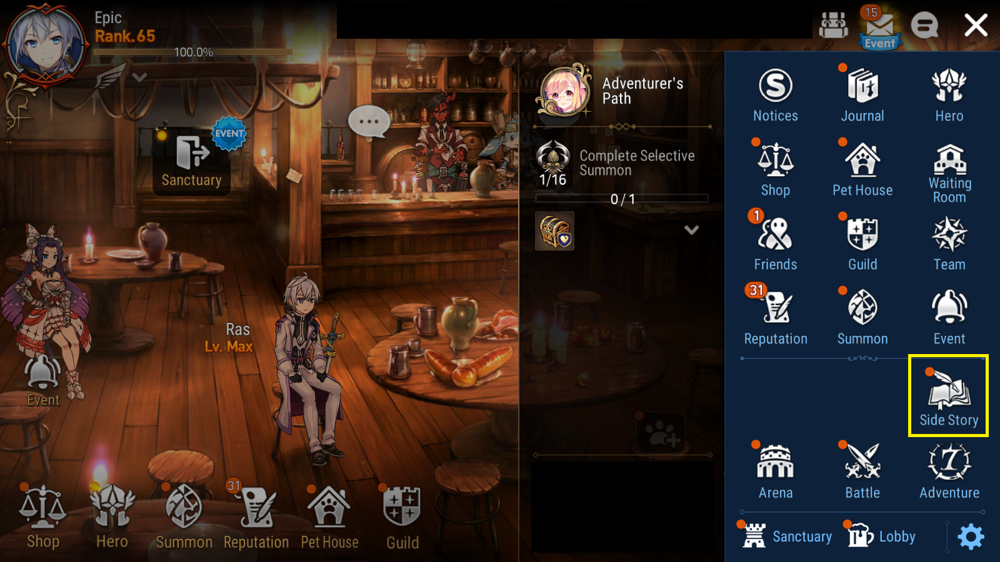
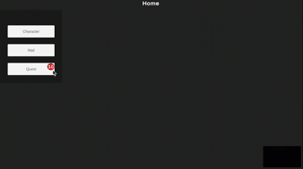
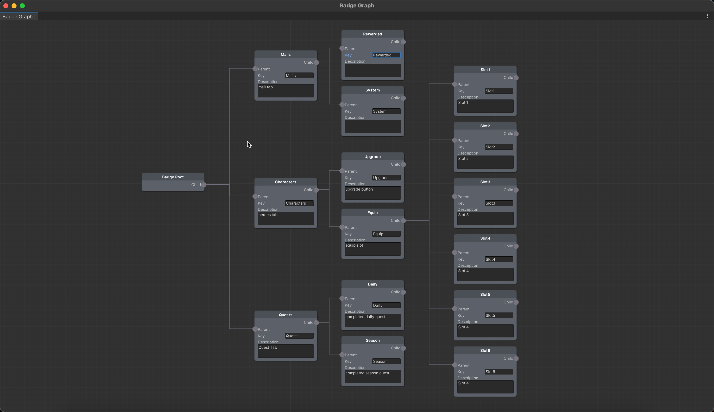

## Introduction

Dot Badge Notifications, also known as red dot notifications, are small icons, typically red, serving as indicators appearing on game UI elements. These simple visual alerts notify users about new content, messages, or events designed to draw the player's attention. By doing so, they play a crucial role in increasing user engagement and retention in games.


This package allows you to create dot badge notifications for all games developed on Unity. It offers a flexible, intuitive, and easy-to-use system; this package provides a visual Badge Node tool for you to design the most complex red dot notification systems.


## Installation

### Dependencies

- UniTask 2.5.1 or newer.
- XNode 1.8.0 or newer.
- MessagePipe 1.7.4 or newer (you may replace it with another Pub/Sub library).

### Installation Methods

**Method 1 Using Package Manager** 

1. Open Package Manager from `Window > Package Manager`.
2. Click the "+" button > `Add package from git URL`.
3. Enter the following URL:
   `https://github.com/felixngd/BadgeNotification.git?path=src/BadgeNotification/Packages/BadgeNotification`

**Method 2** Modify `Packages/manifest.json`

Add the following to the dependencies block:

```json
{
 "dependencies": {
     "com.voidex.badgenotification": "https://github.com/felixngd/BadgeNotification.git#0.2.0"
 }
}
```
## Getting Started

### Badge Graph


First, you need to create a Badge Graph, which is a tool that allows you to visually represent red dot badges on nodes by using descriptive game features or names. The Badge Graph is composed of Badge Nodes, with parent nodes representing main features and child nodes representing sub-features that are aggregated by the parent feature.

To create a Badge Graph, right-click in the directory where you want to store the graph (.asset) file. Select `Create > BadgeNotification > Graph`. Double-click on the newly created file to open the Badge Graph design interface.


### Designing the Badge Graph

First, you need to create a Badge Root node, right-click in an empty area on the Badge Graph window and select `Voidex > Badge > Runtime > Badge Root`.

Create child nodes similarly by selecting `Voidex > Badge > Runtime > Badge`. Enter a key and description for the nodes you create. 

> **Note:** the key is used for manipulation at runtime, and the description is for easier reading of the graph.

## Initialization

Badge Notification works based on the Pub/Sub model, with the state of each dot badge on the UI depending on the BadgeChangedMessage it receives. The system uses the `IPubSub<TMessage>` interface to send and receive these messages. Check the example below to see how to implement the interface using MessagePipe.

**Using MessagePipe**

```csharp
public class MessagePipeMessaging : IPubSub<BadgeChangedMessage>
{
    private readonly IPublisher<string, BadgeChangedMessage> _publisher;
    private readonly ISubscriber<string, BadgeChangedMessage> _subscriber;
    
    public MessagePipeMessaging()
    {
        var builder = new BuiltinContainerBuilder();
        builder.AddMessagePipe(o => o.EnableCaptureStackTrace = true);
        builder.AddMessageBroker<string, BadgeChangedMessage>();

        var provider = builder.BuildServiceProvider();
        GlobalMessagePipe.SetProvider(provider);

        _publisher = GlobalMessagePipe.GetPublisher<string, BadgeChangedMessage>();
        _subscriber = GlobalMessagePipe.GetSubscriber<string, BadgeChangedMessage>();
    }

    public void Publish(BadgeChangedMessage topic)
    {
        _publisher.Publish(topic.key, topic);
    }

    public IDisposable Subscribe(string key, Action<BadgeChangedMessage> callback)
    {
        return _subscriber.Subscribe(key, callback);
    }
}
```
Note that it must be initialized first for the system to operate.
```csharp
IPubSub<BadgeChangedMessage> pubSub = new MessagePipeMessaging();
_badgeMessaging.Initialize(pubSub);
```
Next, initialize the Badge Notification service.
```cs
_badgeNotification = new BadgeNotification();
_badgeNotification.Initialize(badgeGraph);
```
### Displaying dot badge on UI
The package does not specifically implement on any UI system, so you can implement using your UI system. These UI elements need to register to receive BadgeChangedMessage to display.
```cs
_disposable = GlobalMessaging<BadgeChangedMessage>.Subscribe(badgeKey, OnBadgeChanged);
```
See the example of implementing a badge item on the UI below: 
* [DynamicBadgeItem](https://github.com/felixngd/BadgeNotification/blob/master/Assets/BadgeNotification/Scripts/Concretes/DynamicBadgeItem.cs) 
* [SimpleBadgeItem](https://github.com/felixngd/BadgeNotification/blob/master/Assets/BadgeNotification/Scripts/Concretes/SimpleBadgeItem.cs) 
* [TextBadgeItem](https://github.com/felixngd/BadgeNotification/blob/master/Assets/BadgeNotification/Scripts/Concretes/TextBadgeItem.cs)

## Updating BadgeNotification at runtime
### Adding new badge node
You can add a new dot badge (a node) in runtime, this method is very effective in the case of features with items dynamically instantiated in runtime that are not statically designed in the Badge Graph.
```cs
_badgeNotification.AddBadge(key, 1);
```
### Updating the value of a node
Updating the value of a node also simultaneously notifies the parent nodes of the change.
```cs
_badgeNotification.UpdateBadge("Root|Mails|Rewarded", -1);
```
### Retrieving value
```cs
var badge = badgeNotification.GetBadge("Root|Mails|Rewarded");
```
## Technical Explanation

### Trie Data Structure

The Badge Notification system uses a Trie (also known as a prefix tree) data structure to manage the badge nodes. A Trie is a tree-like data structure that is used to store a dynamic set or associative array where the keys are usually strings.

In the context of the Badge Notification system, each node in the Trie represents a badge. The path from root to a node is the badge's identifier, and the value is the badge's count. The root of the Trie represents the root badge, and each path from the root to a node represents the hierarchy of badges.

This structure allows efficient lookup, addition, and update of badges. It also allows efficient computation of aggregate badge counts (i.e., the total count of a badge and all its descendants), which is useful for displaying badge counts on parent UI elements that should show the total count of all their child elements.

### Publish/Subscribe Pattern

The Badge Notification system uses the Publish/Subscribe (Pub/Sub) pattern for notifying the UI about changes in badge counts. In this pattern, publishers (in this case, the Badge Notification system) send messages without knowing who the subscribers (the UI elements) are. Similarly, subscribers listen for specific messages without knowing who the publishers are.

When a badge's count changes, the Badge Notification system publishes a `BadgeChangedMessage`. UI elements that display that badge subscribe to `BadgeChangedMessage`s for that badge's key. When they receive a `BadgeChangedMessage`, they update their display to reflect the new badge count.

This decoupling of publishers and subscribers allows for flexibility and scalability. New UI elements can be added, or existing ones can be removed, without needing to change the Badge Notification system's code. Similarly, the Badge Notification system can change how and when it publishes messages without needing to change the UI code.
## License
[MIT License](https://github.com/felixngd/BadgeNotification/blob/master/LICENSE)